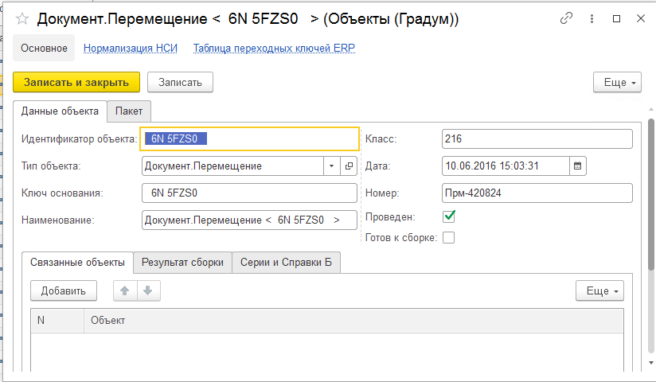
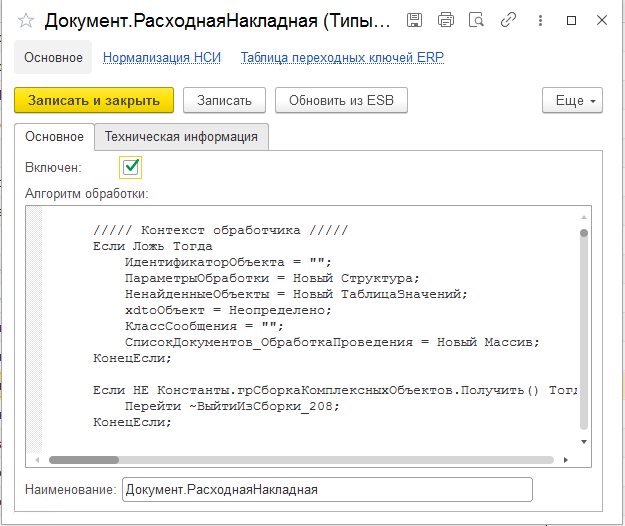
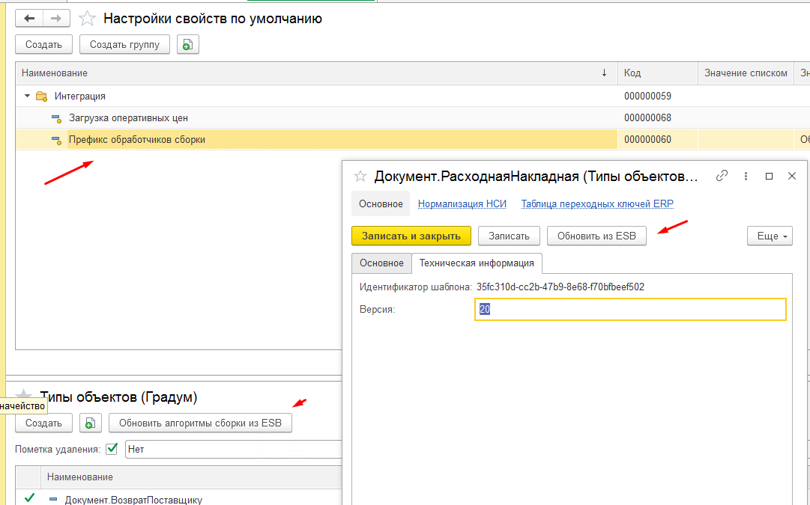

# Интеграция

- [Интеграция](#интеграция)
  - [Подсистема "Сборщик"](#подсистема-сборщик)
    - [Объекты подсистемы](#объекты-подсистемы)
    - [Взаимодействие с DATAREON ESB](#взаимодействие-с-datareon-esb)
  - [Механизм отложенного проведения](#механизм-отложенного-проведения)
  - [Подсистема "Дозапросы"](#подсистема-дозапросы)
  - [Подсистема "Внутренняя очередь"](#подсистема-внутренняя-очередь)

## Подсистема "Сборщик"

Подсистема предназначена для сборки объекта состоящего из итеграционных икрементов ( объектов ).

### Объекты подсистемы

1. **Справочник "Объекты (Градум)"** - служебное хранилище интеграционных инкрементов объекта с частично разобранными данными из xml пакета.

1. **Справочник "Типы объектов (Градум)"** - служебное хранилище типов интеграционных объектов с описанием алгоритма сборки составного объекта.

### Взаимодействие с DATAREON ESB

В качестве репозитория хранения алгоритмов справочника "Типы объектов (Градум) могут выступать обработчики DATAREON ESB.
Для включения данного функционала требуется:

1. Подключить информационную систему к DATAREON ESB.
2. Указать в настройке по умолчанию "*ПрефиксОбработчиковСборки". Поиск обработчиков выполняется по шаблону [ПрефиксОбработчиковСборки]+[%].
3. Вызвать команду "Обновить алгоритмы сборки из ESB".

## Механизм отложенного проведения

## Подсистема "Дозапросы"

Подсистема предназначена для отправка запросов в системы интеграционного контура.

[Подсистема "Дозапросы"](/integration/adrequest)

## Подсистема "Внутренняя очередь"

Подсистема предназначена для организации внутренних очередей из сообщений интеграции, поступающих на обработку из DATAREON ESB.

[Подсистема "Внутренняя очередь"](/integration/inqueue)