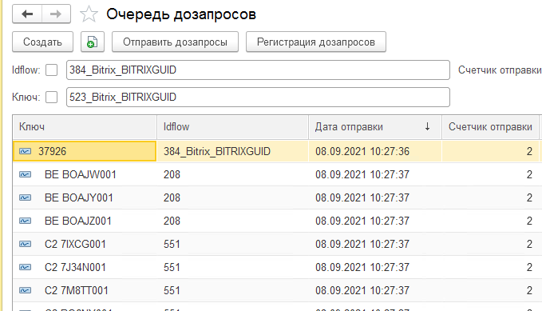

# "Дозапросы"

- ["Дозапросы"](#дозапросы)
  - [Условные обозначения](#условные-обозначения)
  - [Подсистема "Дозапросы"](#подсистема-дозапросы)
    - [Формат дозапроса](#формат-дозапроса)
    - [Объекты подсистемы](#объекты-подсистемы)
    - [Программный интерфейс](#программный-интерфейс)

## Условные обозначения

Дозапрос - запрос на недостающие данные в системs интеграционного контура.

## Подсистема "Дозапросы"

Подсистема предназначена для отправки, обработки дозапросов формируемые при обработке сообщений Datareon ESB.
Поддерживается два режима работы:

- Оперативный. Дозапрос отправляются в момент обработки сообщения.
- Отложенный. Дозапрос и сообщение Datareon ESB записываются в промежуточные хранилища ["Объекты подсистемы"](#объекты-подсистемы).

### Формат дозапроса

Дозапрос представлен в виде xml пакета с обязательным набором тегов:

- ID - идентификатор объекта ( уникальный ключ)
- Class - идентификатор интеграционного потока, именуемый далее idflow. Описание идентификаторов хранится в служебном обработчике DatareonESB "ИдентификаторыПотоковESB".
idflow формируется по шаблону {МетаданныеПолноеИмяМастерСистема}_{МастерСистема}_{ВидКлюча}, для системы УНИКУМ возможно использование цифрого кода. Пример настроечного файл описания idflow [Идентификаторы потоков ESB](ИдентификаторыПотоковESB.bsl).
Для просмотра текущих idflow используется отчет  ["Получение записей идентфикаторов потоков ESB"](ПолучитьЗаписиИдентфикаторыПотоковESB.epf).

```xml
<classData xmlns:xsi="http://www.w3.org/2001/XMLSchema-instance">
  <ID> 618 C5AN1001</ID>
  <Class>320</Class>
</classData>

<classData xmlns:xsi="http://www.w3.org/2001/XMLSchema-instance">
  <ID> 618 C5AN1001</ID>
  <Class>497_Bitrix_BITRIXGUID</Class>
</classData>
```

### Объекты подсистемы

- **Регистр сведений "Очередь дозапросов"** -  хранилище запросов.



- **Регистр сведений "Источники дозапросов"** - хранилище дозапросов.
- ["Исходящий обработчик"](Request.Out.bsl) - Исходящий обработчик Datareon ESB.

### Программный интерфейс

Программный интерфейс реализован в общем модуле грОбработкаПакетовИнтеграции область "Дозапросы".

Пример использования ["Пример обработчика Datareon ESB"](ПримерВходящегоОбработчика.bsl).
