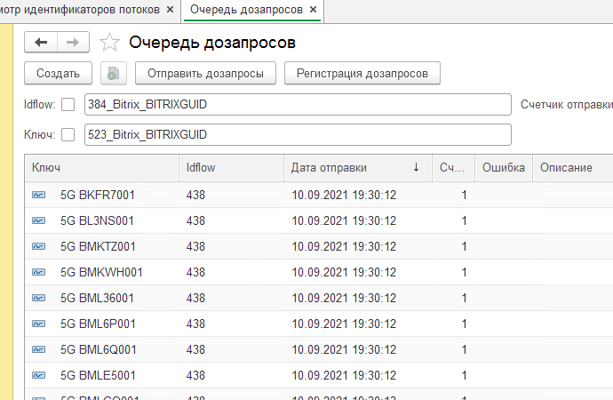
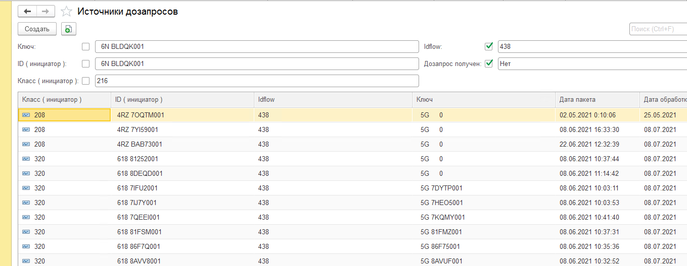

# "Дозапросы"

- ["Дозапросы"](#дозапросы)
  - [Условные обозначения](#условные-обозначения)
  - [Подсистема "Дозапросы"](#подсистема-дозапросы)
    - [Формат дозапроса](#формат-дозапроса)
    - [Объекты подсистемы](#объекты-подсистемы)
    - [Программный интерфейс](#программный-интерфейс)
    - [Примеры использования](#примеры-использования)

## Условные обозначения

- Дозапрос - запрос на недостающие данные из систем интеграционного контура.
- idflow - идентификатор описания интеграционного потока дозапросов.

## Подсистема "Дозапросы"

Подсистема предназначена для отправки, обработки дозапросов формируемые при обработке сообщений Datareon ESB.

Поддерживается два режима работы:

- Оперативный. Дозапросы отправляются в момент обработки сообщения.
- Отложенный. Дозапросы и сообщение Datareon ESB записываются в промежуточные хранилища ["Объекты подсистемы"](#объекты-подсистемы).
Включение отложенного режима регулируется **константой "Использовать отложенные дозапросы"** с использованием методов программного [интерфейса](#программный-интерфейс) во входящих обработчиках.

### Формат дозапроса

Структура дозапроса представлена в виде xml пакета с обязательным набором тегов:

- ID - идентификатор объекта ( уникальный ключ )
- Class - idflow, формируется по шаблону {МетаданныеПолноеИмяМастерСистема}\_{МастерСистема}\_{ВидКлюча},
УНИКУМ использует цифровой код. Описания используемых idflow хранится в служебном обработчике Datareon ESB ["ИдентификаторыПотоковESB"](#объекты-подсистемы).
Для просмотра текущих idflow используется отчет  ["Получение записей идентфикаторов потоков ESB"](ПолучитьЗаписиИдентфикаторыПотоковESB.epf).

```xml
<classData xmlns:xsi="http://www.w3.org/2001/XMLSchema-instance">
  <ID> 618 C5AN1001</ID>
  <Class>320</Class>
</classData>

<classData xmlns:xsi="http://www.w3.org/2001/XMLSchema-instance">
  <ID> 618 C5AN1001</ID>
  <Class>497_Bitrix_BITRIXGUID</Class>
</classData>
```

**Отправка дозапроса выполняется по Request[32] классу Datareon ESB.**

### Объекты подсистемы

- **Константа "Использовать дозапросы"** - отвечает за включение подсистемы "Дозапросы".
- **Константа "Использовать отложенные дозапросы"** - отвечает за включение режима отложенных дозапросов.
- **Константа "Использовать исключения для не найденных объектов дозапросы"** - вызывает в обработчике исключения при наличии ненайденных объектов.
- **Служебный обработчик [Идентификаторы потоков ESB](ИдентификаторыПотоковESB.bsl)** - Исходящий обработчик Datareon ESB c описанием настроек idflow
- **[Исходящий обработчик "Request.Out"](Request.Out.bsl)** - Исходящий обработчик Datareon ESB отвечающий за отправку дозапросов.
- **Регламентное задание "Обработать пакеты"** - задание на обработку записей регистра сведений "Источники дозапрсов" по которым пришли все дозапросы.
- **Регламентное задание "Отправка дозапросов"** - задание на отправку дозапросов из регистра сведений "Очерередь дозапросов".
- **Регламентное задание "Очистить отложенные дозапросы"** - задание на очистку записей из регистра сведений "Источники дозапрсов" по которым пришли все дозапросы и выполнена повторная обработка сообщения Datareon ESB.
- **Регистр сведений "Очередь дозапросов"** -  хранилище дозапрасов.
  
  
  
  Ключевые настройки:
  - **Константа "Количесто попыток отправок дозапросов"** - количество попыток отправки дозапросов в автоматическом режиме
  - **Команда "Отправить дозапросы"** - ручная отправка дозапросов в Datareon ESB.
  - **Команда "Регистрация дозапросов"**- ручная регистрация дозапросов.

- **Регистр сведений "Источники дозапросов"** - хранилище дозапросов.
  
  

### Программный интерфейс

- **СоздатьДозапросыПоТаблице**
  
  Помещает дозапросы в очередь исходящих сообщений и регистрирует в РС грОчередьДозапросов

    Синтаксис

    Процедура СоздатьДозапросыПоТаблице(ТаблицаНенайденных, Таймаут = 3600, КоличествоПопытокБлокировки = 0, ТаблицаИдентификаторовПотоков = Неопределено) Экспорт

Параметры:
  ТаблицаНенайденных    - ТаблицаЗначений - см. СоздатьТаблицуНенайденныхОбъектов.
  Таймаут       - Таймаут дозапроса в секундах.
  КоличествоПопытокБлокировки  - Число - количество попыток блокировки РС грОчередьДозапросов
  ТаблицаИдентификаторовПотоков - ТаблицаЗначений - таблица идентификаторов потоков.

  Пример вызова

```bsl
  Если ПараметрыОбработки.ВыполнятьДозапросы И НенайденныеОбъекты.Количество() > 0 Тогда 
    грОбработкаПакетовИнтеграции.СоздатьДозапросыПоТаблице(
    НенайденныеОбъекты, 
    ПараметрыОбработки.ТаймаутДозапроса, 
    ПараметрыОбработки.КоличествоПопытокБлокировки, 
    ТаблицаИдентификаторовПотоков);
    СостояниеСообщения = Перечисления.сшпСтатусыСообщений.ОжиданиеОбработки;
    Задержка = ПараметрыОбработки.ЗадержкаПриДозапросе;
  КонецЕсли;
```

- **ЗаписатьОтложенныеДозапросы**

 Записывает отложенные дозапросы по таблице ненайденных объектов

Синтаксис

 Процедура ЗаписатьОтложенныеДозапросы( ID, МетаданныеПолноеИмя, Класс, Знач xdtoОбъект,
ПараметрыОбработки, ТаблицаНенайденных = Неопределено, ДопПараметры = Неопределено ) Экспорт

Параметры:

- ID                            - Строка    - ИдентификаторОбъекта инициатора дозапроса
- Класс                           - Строка    - класс инициатора дозапроса
- МетаданныеПолноеИмя - Строка - полное имя метаданных
- xdtoОбъект                      - ОбъектXDTO - загружаемый пакет
- ТаблицаНенайденных    - ТаблицаЗначений - см. СоздатьТаблицуНенайденныхОбъектов
- ПараметрыОбработки    - Структура, параметры обработки пакета
- ДопПараметры     - Структура, может содержать поле ВидИдентификатора
  \* Дата - Дата - дата загружаемого объекта, используется для контроля загрузки исторических данных

Пример вызова

```bsl
  ТаблицаИдентификаторовПотоков = грОбработкаПакетовИнтеграцииПовтИсп.ПолучитьТаблицуИдентификаторыПотоковESB();

  ДопПараметрыДозапросов = Новый Структура;
  ДопПараметрыДозапросов.Вставить("ID", Ключ);
  ДопПараметрыДозапросов.Вставить("Класс", КлассСообщения);

  ДокОбъект.Договор = грОбработкаПакетовИнтеграции.НайтиОбъектПоКлючу(xdtoОбъект.Договор,
    "Справочник.ДоговорыКонтрагентов", "УНИКУМGUID", "229", НенайденныеОбъекты, КэшСсылок, ДопПараметрыДозапросов);

  ДопПараметры.Вставить( "Дата", ДокОбъект.Дата); 
  грОбработкаПакетовИнтеграции.ЗаписатьОтложенныеДозапросы( Ключ, ИмяТипаОбъекта, КлассСообщения, xdtoОбъект, ПараметрыОбработки, НенайденныеОбъекты, ДопПараметры );
```

### Примеры использования

Программный интерфейс реализован в общем модуле грОбработкаПакетовИнтеграции область "Дозапросы".

Пример использования ["Пример обработчика Datareon ESB"](ПримерВходящегоОбработчика.bsl).
