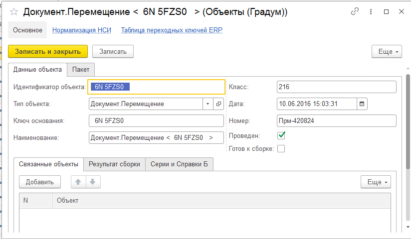
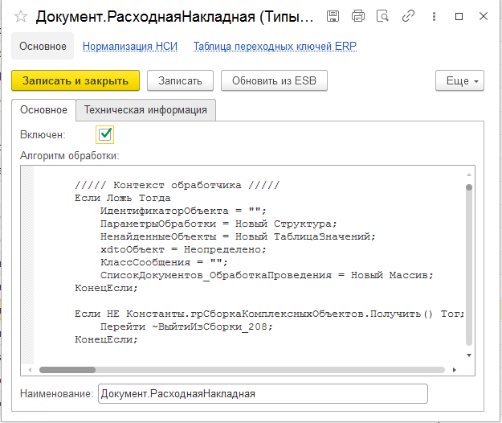
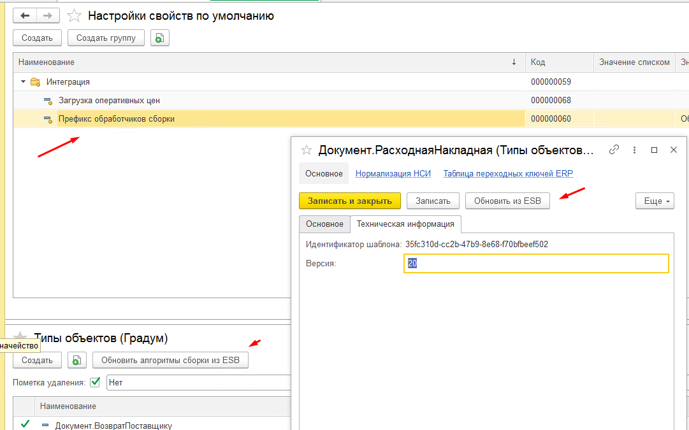

# Сборщик

1. [Сборщик](#сборщик)
   1. [Условные обозначения](#условные-обозначения)
   2. [Подсистема "Сборщик"](#подсистема-сборщик)
      1. [Объекты подсистемы](#объекты-подсистемы)
      2. [Программный интерфейс](#программный-интерфейс)
      3. [Примеры использования](#примеры-использования)
      4. [Взаимодействие с DATAREON ESB](#взаимодействие-с-datareon-esb)

## Условные обозначения

Интеграционный инкремент -  объект системы источника, который входит в состав формируемого объекта системы приемник.

## Подсистема "Сборщик"

Подсистема предназначена для сборки объекта системы приемник состоящего из интеграционных икрементов ( объектов ) системы источник.

### Объекты подсистемы

- **Справочник "Объекты (Градум)"** - служебное хранилище интеграционных инкрементов объекта. Элемент справочника хранит сообщение интеграции с частично разобранные данными.



- **Справочник "Типы объектов (Градум)"** - служебное хранилище типов интеграционных инкрементов с описанием алгоритма сборки составного объекта приемника.



- **Константа "Сборка комплексных объектов"** - включает сборку объектов при вызове обработчиков сборки интеграции.
- [**Cлужебный обработчик "Служебный_ВыполнитьАлгоритмСборки.in"**](Служебный_ВыполнитьАлгоритмСборки.in.bsl) - служебный исходящий обработчик Datareon ESB для вызова алгоритма сборки.
- [**Cлужебный обработчик "Служебный_СформироватьВходящийПакетОбъектаЕРП.in"**](Служебный_СформироватьВходящийПакетОбъектаЕРП.in.bsl) - служебный исходящий обработчик Datareon ESB для записи инкремента объекта.

### Программный интерфейс

- **Запись интеграционного инкремента**
  
```bsl
  //+++ Сборщик.Формирование интеграционного инкремента
  НаименованиеТипаОбъекта = "Документ.Списание";
  ПараметрыВходящегоПакета = Новый Структура("КлючОснования", Ключ); 
  Выполнить(грОбработкаПакетовИнтеграции.ПолучитьТекстОбработчика("Служебный_СформироватьВходящийПакетОбъектаЕРП", 
   Перечисления.сшпТипыИнтеграции.Исходящая));
  //--- Сборщик.Формирование интеграционного инкремента 
```

- **Запуск алгоритма сборки**
  
```bsl
//+++ Сборщик.Запуск сборки
спрИмяТипаОбъекта = "Документ.Списание";
ИдентификаторОбъекта = Ключ;
Выполнить(грОбработкаПакетовИнтеграции.ПолучитьТекстОбработчика("ВыполнитьАлгоритмСборки", 
Перечисления.сшпТипыИнтеграции.Исходящая));
//--- Сборщик. Запуск сборки
```

### Примеры использования

Пример использования ["Пример обработчика Datareon ESB"](СписаниеНедостачТоваров_ERP.in.bsl).

### Взаимодействие с DATAREON ESB

В качестве репозитория хранения алгоритмов справочника "Типы объектов (Градум) могут выступать обработчики DATAREON ESB.
Для включения данного функционала требуется:

1. Подключить информационную систему к DATAREON ESB.
2. Указать в настройке по умолчанию "*ПрефиксОбработчиковСборки". Поиск обработчиков выполняется по шаблону [ПрефиксОбработчиковСборки]+[%].
3. Вызвать команду "Обновить алгоритмы сборки из ESB".


