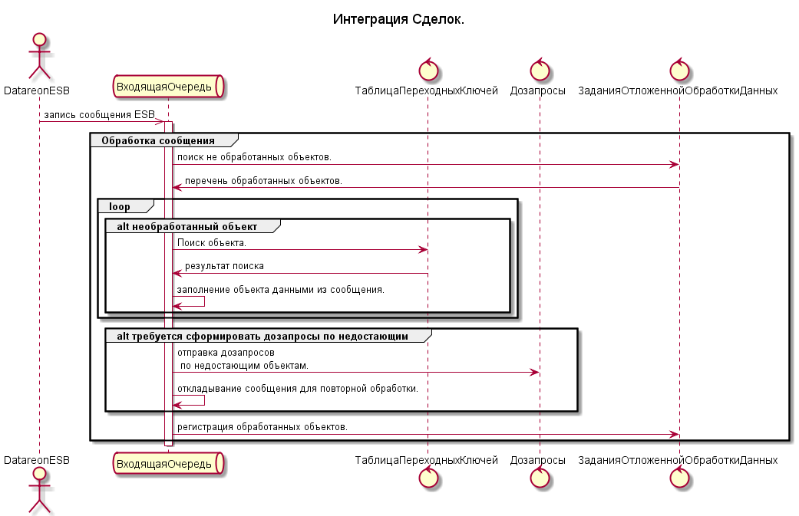

# Интеграция

- [Интеграция](#интеграция)
  - [Схемы взаимодействия подсистем](#схемы-взаимодействия-подсистем)
    - [Пример 1. Интеграция объекта с использованием "Сборки", режим дозапросов отложенный](#пример-1-интеграция-объекта-с-использованием-сборки-режим-дозапросов-отложенный)
    - [Пример 2. Интеграция объекта с использованием подсистемы "Задания отложенной обработки данных" для логирования успешно загруженных объектов, режим дозапросов оперативный](#пример-2-интеграция-объекта-с-использованием-подсистемы-задания-отложенной-обработки-данных-для-логирования-успешно-загруженных-объектов-режим-дозапросов-оперативный)

## Схемы взаимодействия подсистем

### Пример 1. Интеграция объекта с использованием "Сборки", режим дозапросов отложенный

Пример демонстрирует интеграцию документа "Списание недостач товаров" с использованием подсистем:

- Входящая очередь
- Таблица переходных ключей
- Дозапросы
- Сборщик
- Отложенное проведение

Описание примера :
Документ "Списание недостач товаров" системы ЕРП формируется на основании документов системы УНИКУМ "Списание", "Партия", "СправкаБ".

Документы "Списание", "Партия", "СправкаБ" могут загружаться в ЕРП в произвольном порядке.

Глоссарий:

- Интеграционный инкремент - объект системы источника, который участвует в формировании  объекта системы приемник. Например документ "Списание недостач товаров" , может быть сформирован из следующих инкрементов 1 документом "Списание", 1 документом "Партия", 3 документами "СправкаБ".

### Пример 2. Интеграция объекта с использованием подсистемы "Задания отложенной обработки данных" для логирования успешно загруженных объектов, режим дозапросов оперативный

Пример демонстрирует интеграцию сделок с использованием подсистем:

- Входящая очередь
- Таблица переходных ключей
- Дозапросы
- Задания отложенной обработки данных
