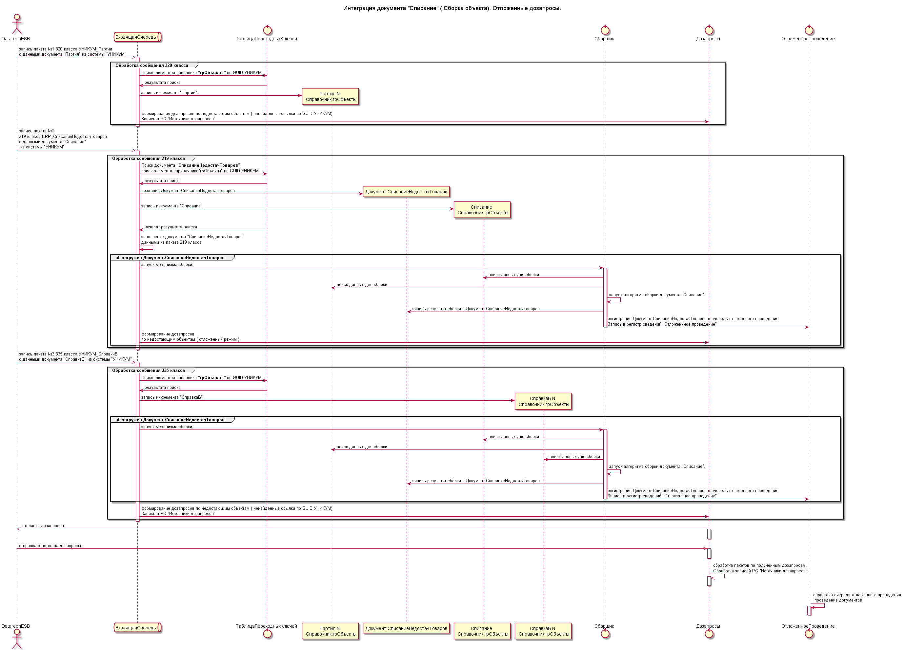

# Интеграция

- [Интеграция](#интеграция)
  - [Схемы взаимодействия подсистем](#схемы-взаимодействия-подсистем)
    - [Пример 1. Интеграция объекта с использованием "Сборки", режим дозапросов отложенный](#пример-1-интеграция-объекта-с-использованием-сборки-режим-дозапросов-отложенный)
    - [Пример 2. Интеграция объекта с использованием подсистемы "Задания отложенной обработки данных" для логирования успешно загруженных объектов, режим дозапросов оперативный.](#пример-2-интеграция-объекта-с-использованием-подсистемы-задания-отложенной-обработки-данных-для-логирования-успешно-загруженных-объектов-режим-дозапросов-оперативный)

## Схемы взаимодействия подсистем

### Пример 1. Интеграция объекта с использованием "Сборки", режим дозапросов отложенный

### Пример 2. Интеграция объекта с использованием подсистемы "Задания отложенной обработки данных" для логирования успешно загруженных объектов, режим дозапросов оперативный.

