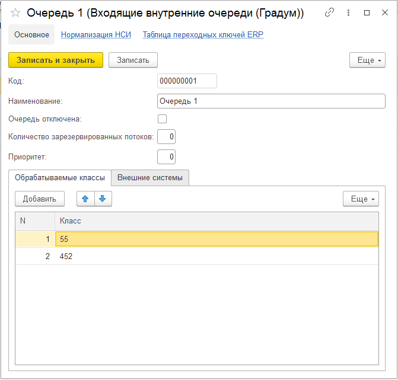

# inqueue

## Подсистема "Внутренняя очередь"

Подсистема предназначена для организации внутренних очередей из сообщений, поступающих на обработку.

Цели подсистемы:

1. Предотвращение образования очередей в передающей системе;
1. Распределение поступающих сообщений по очередям, в зависимости от настроек очереди и статистики сообщений в очереди;
1. Обработка сообщений в зависимости от приоритетов в настройках очередей;
1. Балансировка нагрузки при поступлении большого количества сообщений в очередь;
1. Организации многопоточной обработки сообщений из очереди;

Объекты подсистемы находятся в разделе Datareon.

ESB Настройки подсистемы – настройки параметров работы подсистемы.

Входящие внутренние очереди (Градум) – справочник используемых очередей, в котором настраиваются обрабатываемые классы, системы, приоритет очереди и количество зарезервированных потоков.

Очередь входящих сообщений – реестр поступивших сообщений.

Состояние сообщений – реестр состояния поступивших сообщений.

Статистика внутренних очередей – реестр количества сообщений по каждой очереди.

Отчет Сбор статистики обработки сообщений ESB (Градум) – отчет, позволяющий просмотреть статистику работы очередей.

Консоль заданий ESB – обработка, которая показывает запущенные в настоящий момент задания обработки очередей и количество сообщений в обработке у задания.

## Основные настройки

На закладке основные настройки расположены настройки:

Использовать внутреннюю очередь ( Datareon ) – основная настройка, которая определяет используется подсистема, или не используется.

Максимальное число откладывания сообщений в 1С – количество попыток отложить обработку сообщения в случае необходимости, например, необходимость запросить дополнительные данные. После достижения количество попыток сообщению присваивается статус «Ошибка обработки» с описанием «Превышено максимальное количество попыток откладывания» и сообщение больше автоматически не обрабатывается.

Длительность хранения входящих сообщений по умолчанию – настройка, которая определяет длительность хранения входящих сообщений по умолчанию в днях. Применяется для входящих сообщений со статусом, для которого не указана длительность хранения в настройке «Длительность хранения входящих сообщений по статусам». После истечения срока хранения сообщение будет автоматически удалено.

Длительность хранения входящих сообщений по статусам – определяет длительность хранения сообщений в днях для определенных статусов. После истечения срока хранения сообщение будет автоматически удалено.

На закладке настройки потоков обработки расположены настройки:

Количество потоков обработки очередей – общее количество потоков обработки очередей. Значение должно быть больше, чем количество зарезервированных потоков обработки в настройках очередей. Настройки очередей будут рассмотрены ниже.

Количество зарезервированных потоков обработки очередей – в настоящее время настройка не используется. Использование планируется в следующих версиях подсистемы.

Количество потоков обработки приоритетов – настройка определяет количество потоков для обработки приоритетных очередей. В случае, если все поступающие сообщения не успевают обрабатываться зарезервированными для очередей потоками, то запускаются дополнительные потоки обработки очередей. Распределение потоков по очередям осуществляется в зависимости от настройки приоритетов очередей. Настройки очередей будут рассмотрены ниже.

Количество потоков балансировки нагрузки – количество потоков, которые подключаются к обработке очередей с наибольшим количеством необработанных сообщений. Распределение дополнительных потоков по очередям осуществляется в зависимости от количества необработанных сообщений.

## Настройки очередей

На форме справочника входящие очереди предусмотрены следующие настройки:

Очередь отключена – при отключении очереди в нее перестают поступать сообщения, так же приостанавливается обработка сообщений из очереди.

Количество зарезервированных потоков – настройка определяет, сколько потоков из общего числа потоков зарезервированы за данной очередью. Зарезервированные потоки обрабатывают только сообщения из данной очереди и не используются подсистемой для других целей. Общее число потоков обработки должно быть больше общего числа зарезервированных потоков.

Приоритет – в зависимости от настройки осуществляется распределение потоков обработки приоритетов. Чем больше приоритет, тем большее количество потоков обработки приоритетов будет запущено.

На закладке обрабатываемые классы указываются классы сообщений, для обработки которых, предназначена очередь, а на вкладке внешние системы – системы, из которых следует обрабатывать указанные классы. По этим настройкам определяется очередь, в которую будет помещено входящее сообщение. Если будет обнаружено две подходящие очереди, то сообщение будет помещено в очередь с меньшим количеством необработанных сообщений.
