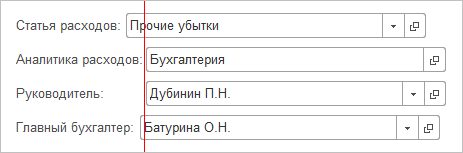
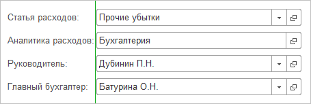

# Регламент разработки на проекте автоматизации компании Лудинг

- [Общие сведения](#общие-сведения)
- [Среда разработки](#среда-разработки)
- [Выполнение заданий на разработку](#выполнение-заданий-на-разработку)
- [Тестовая среда](#тестовая-среда)
- [Продуктивная среда](#продуктивная-среда)

## Общие сведения

В документе описан подход к организации и ведению разработки на проекте, требования к оформлению кода, порядок работы с хранилищем 1С, работа в среде ESB отладка и стандарт разработки интеграционных обработчиков, работа в продуктивной среде, порядок обновления тестовых и продуктивных баз данных.

### Общая информация о объектах разработки

| Конфигурация                     | Описание                                                     |
| -------------------------------- | ------------------------------------------------------------ |
| **ЕРП (для оперативного учета)** | Не обновляемая конфигурация с высокой степенью кастомизации. При разработке не используются расширения.    -Разработка блока CRM ведется Лудингoм -Все прочие блоки разрабатываются Градумом Ведение разработки блока CRM на текущий момент частично покрывается данным регламентом в части правил работы с хранилищем разработки |
| **УХ**                           | Обновляемая конфигурация при разработке применяются методики для обеспечения простого обновления. Разработка конфигураци приостановлена |
| **Уникум**                       | Конфигурация находится на поддержке у Лудинга, Градум может инициировать изменения, необходимые для достижения целей проекта в порядке, предусмотренном данным регламентон. Сами процессы разработки, обновления не покрываются данным регламентом |
| **ТМС**                          | Конфигурация разрабатывается отдельной командой разработчиков, порядок взаимодействия на текущий момент не определен |
| **WMS**                          | Конфигурация разрабатывается отдельной командой разработчиков, порядок взаимодействия на текущий момент не определен |
| **ESB**                          | Интеграционная шина - не является конфигурацией, предоставляет инструментарий для транспорта данных, администрирования интеграционных обработчиков. Регламент содержит информацию о правилах модификации обработчиков интеграции |
| **СППР**                         | Система проектирования прикладных решений -- управление функциональными требованиями, описание функций, процессов, интеграционных потоков. Поддерживается Градумом |

Раздел актуализируется по мере необходимости.

## Среда разработки

- [Начало документа](#регламент-разработки-на-проекте-автоматизации-компании-лудинг)
- [Общая информация](#общая-информация)
- [Базы и хранилища разработки](#базы-и-хранилища-разработки)
- [Шина и интеграционный контур среды разработки](#шина-и-интеграционный-контур-среды-разработки)

### Общая информация

Для целй разработки организована среда DEV. Среда используется командой
Градум и Лудинг в части разработки блока CRM

DEV среда представлена независимыми серверами:

-   СУБД MS SQL
-   Сервер приложений 1С
-   Сервер хранилища 1С

| Сервер         | Описание                                                     |
| -------------- | ------------------------------------------------------------ |
| crc-erp-dev-01 | Терминальный сервер. На сервере работают сотрудники компании Градум. Осуществляется работа с DEV, TEST и PROD средами **Клиент 1С77, Клиент 1С 8, Консоль управление Datareon ESB** |
| crc-erp-dev-03 | На сервере находятся все базы разработчиков и хранилище разработки **Сервер приложений 1С, Сервер хранилища 1С, MS SQL** |

Администрирование виртуальных серверов выполняется силами Градума, вопросы, которые нельзя решить на уровне виртуального сервера. Доменная учетная запись и доступ к серверу crc-erp-dev-01 предоставляется разработчику при подключении к проекту. Работа ведется непосредственно на терминальном сервере.

[Среда разработки](#среда-разработки)

### Базы и хранилища разработки

В DEV среде для каждого разработчика создается индивидуальная база разработки. При создании баз разработки в названии базы указывается ключевое слово конфигурации и признак среды (пример ERP_DEV_05);

Все базы разработки подключены к соответствующему DEV хранилищу

| Хранилище | Описание                                   |
| --------- | ------------------------------------------ |
| erp_dev   | Хранилище ЕРП tcp://crc-erp-dev-03/erp_dev |
| uh_dev    | Хранилище УХ tcp://crc-erp-dev-03/uh_dev   |
| sppr      | Хранилище СППР tcp://crc-erp-dev-03/sppr   |

Для экономия дискового пространства базы разработчиков урезанные, в исключительных случаях для разработчика может быть развернута копия продуктивной базы -- согласовывается отдельно с РП.

[Среда разработки](#среда-разработки)

### Шина и интеграционный контур среды разработки

Базы разработки не подключены шине данных разработка и первичная отладка обработчиков интеграции выполняется в локальной базе разработчика с использованием специальной отладочной обработки **ОтладкаОбработчиков.epf**. 

[Среда разработки](#среда-разработки)

## Выполнение заданий на разработку

- [Начало документа](#регламент-разработки-на-проекте-автоматизации-компании-лудинг)
- [Система управления задачами](#система-управления-задачами)
- [Работа с хранилищем разработки](#работа-с-хранилищем-разработки)
- [Работа по задачам разработки интеграционных обработчиков ESB](#работа-по-задачам-разработки-интеграционных-обработчиков-ESB)
- [Требования к оформлению кода, подход к разработке](#требования-к-оформлению-кода-подход-к-разработке)
- [Проведение код-review](#Проведение-код-review)

### Система управления задачами

<!--*Написать про подключение к битрикс (жира), для доску ЕРП первый релиз, про колонки канбан откуда брать задачу куда перемещать, про внутрянку задачи, ответственных, комментарии, про отражение фактического времени, план и сроки*-->

### Работа с хранилищем разработки

-   Перед захватом корня -- важно обновить конфигурацию своей локальной тестовой БД из хранилища, чтобы исключить возникновение ошибок вида "обработчик события не найден\" и т.д.;
    
-   Сразу после выполненя операций для которых захватывался корень, его необходимо отпустить. Планируйте на работы с захваченым корнем не более 1 часа;
    
-   Для задач разработки не захватывайте корень рекурсивно;

-   Допустимо делать коммиты в хранилище только после выполнения отладки и технического тестирования, обязательно прохождение синтаксического контроля. Техническое тестирование делает разработчик.
    
-   Для задач, по которым тестирование аналитиков выполняется в базе разработчика, коммит в хранилище возможен после положительного прохождения тестов;
    
-   Рекомендуется полностью обновлять конфигурацию из хранилища каждый вечер, перед окончанием рабочего дня;
    
-   По вопросам работы хранилища, коллизиям при захвате объектов необходимо писать в проектную группу в Скайп;
    
-   Необходимо делать коммиты в хранилище в разрезе одной конкретной задачи;
    
-   При помещении в хранилище необходимо убедиться, что нет регистров без регистраторов, подписок с несуществующими обработчиками, объектов без указания подсистем;
    
-   При выполнении коммита обязателен комментарий (используйте поле комментарий, метка не заполняется)
    
-   Шаблон комментария:

    -   Номер задачи (Битрикс, Жира)
-   Ссылка на задачу (Битрикс, Жира)
    -   Описание сделанного

[Выполнение заданий на разработку](#выполнение-заданий-на-разработку)

### Работа по задачам разработки интеграционных обработчиков ESB

- Интеграционные обработчики ESB разрабатываются вне хранилища конфигурации - результат разработки/корректировки обработчика - текстовый файл, привязанный к задаче разработки обработчика;
- Текст обработчика должен быть отлажен в базе разработки с помощью специализированной внешней обработки **ОтладкаОбработчиков.epf** (предоставляет архитектор ESB);
- Интеграционный обработчик имеет стандартную структуру, описание структуры и концептуальные функции подсистемы интеграции определены в эталонном обработчике **ЭталонныйОбработчик.bsl** (предоставляет архитектор ESB);
- Класс информационного сообщения создается архитектором с заполненной структурой
- При разработке новых обработчиков необходимо по возможности следовать структуре эталонного обработчика
Структура эталонного обработчика
- Возможные отклонения структуры разрабатываемого интеграционного обработчика от эталона должны быть согласованы с архитектором ESB;
- При разработке обработчиков необходимо использовать функции общих модулей грОбработкаПакетовИнтеграции, грОбработкаПакетовИнтеграцииПовтИсп, которые содержат интеграционные методы, обеспеивающие работу с  Таблицей Переходных Ключей (далее ТПК) и другими аспектами, реализованными для систем 1С8 в рамках проекта;
- Инициативы по доработке библиотеки концептуальных функций подсистемы интеграции обсуждаются с архитектором ESB;
- Код интеграционного обработчика должен удовлетворять общим требованиям к оформлению кода.
- Тестирование обработчиков ведется на контуре "Витрина" в обработчиках с префиксом «Т_.
- Служебные обработчики используют префикс «Служебный_»
- Удаляемые обработчики используют префикс «Удалить_»
- Продуктивные обработчики не используют префикс "Т_"
- Перенос изменений протестированных обработчиков выполняется архитектором с фиксацией версии тестового обработчика в комментарии.

[Выполнение заданий на разработку](#выполнение-заданий-на-разработку)

### Требования к оформлению кода, подход к разработке 

- [Выполнение заданий на разработку](#выполнение-заданий-на-разработку)
- [Правила комментирования](#Правила-комментирования)
- [Правила добавления и изменения объектов метаданных](#Правила-добавления-и-изменения-объектов-метаданных)
- [Доработка форм](#Доработка-форм)
- [Модули конфигурации](#Модули-конфигурации)
- [Интерфейс](#Интерфейс)
- [Повторное использование кода, стандартные библиотеки](#Повторное-использование-кода-стандартные-библиотеки)
- [Регистрация ошибок, сообщения и предупреждения](#Регистрация-ошибок-сообщения-и-предупреждения)
- [Оформление модулей](#Оформление-модулей)
- [Методы](#Методы)
- [Условия](#Условия)
- [Переменные](#Переменные)
- [Имена процедур, функций, переменных](#Имена-процедур-функций-переменных)

Текущее описание совместно с методиками и стандартами фирмы 1С является основой для определения нормативных критериев оценки качества кода. В случае противоречий между текущим описанием и стандартами 1С необходимо руководствоваться данным описанием.

Методические материалы фирмы «1С» - ["Система стандартов и методик разработки конфигураций для платформы "1С: Предприятие
8"](https://its.1c.ru/db/v8std)

#### Правила комментирования 

**Шаблон комментария в модулях**

```
// Градум; <ФамилияИсполнителя> (<?"", ДатаВремя,"ДФ='dd.mm.yyyy'">)); №.<НомерЗадачи>
```

*\> НомерЗадачи - Номер задачи из Битрикса или Жиры Если задача из битрикса необходим префикс «B».*

При изменении блоков кода необходимо указывать начало и окончание вносимых изменений. При этом, комментарий блока кода в начале должен начинаться с //+++, а комментарий в конце с //\-\--}.

```
// +++Градум; <ФамилияИсполнителя> (<?"", ДатаВремя,"ДФ='dd.mm.yyyy'">)); №.<НомерЗадачи>

// ---Градум; <ФамилияИсполнителя> (<?"", ДатаВремя,"ДФ='dd.mm.yyyy'">)); №.<НомерЗадачи>
```

после символа \"// \" необходим пробел, инче автоматизированные системы проверки кода будут указывать на ошибку.

Пример комментария:

```
// +++ Градум; Смирнов; 25.01.2021; №0000176234

// Измененный/Добавленный код

// --- Градум; Смирнов; 25.01.2021; №0000176234
```

**Правила комментирования в модулях**

Если выполняется изменение кода типовой конфигурации, то удаляемый код должен быть закомментирован. Если доработки выполняются в нетиповых объектах, неиспользуемый код удаляется. Пример доработки типового модуля:

```
//Код до модификации
ПеременнаяТиповогоКода = Значение1;
ПроцедураТиповогоКода( Значение1, Значение2 );

//Код после модификации:
ПеременнаяТиповогоКода = Значение1;

// +++ Градум; Смирнов; 20.12.17; №0000176234

НоваяПеременная = грПреобразоватьЗначение(Значение1);
//ПроцедураТиповогоКода( Значение1, Значение2 );
ПроцедураТиповогоКода( НоваяПеременная, Значение2 );
.....
// --- Градум; Смирнов; 20.12.17; №0000176234
```

Если добавляется новая процедура/функция в существующий модуль, то комментарии к ней необходимо писать в начале процедуры (для каждой процедуры, если их несколько). Ниже строки КонецПроцедуры никаких комментариев не писать! То же самое касается объявления общих переменных в начале модуля. Это необходимо для правильного сравнения-объединения модулей.

```
// +++ Градум; Смирнов; 20.12.17; №0000176234 №ITMNK-00382
// Заголовок процедуры
Процедура НоваяПроцедура()
...
КонецПроцедуры // ниже этой строки ничего не писать!
```

**Общие правила комментирования**

-   Простой код необходимо писать и структурировать так, чтобы никаких дополнительных пояснений к нему не требовалось;
-   Комментарии, которые не поясняют, а пересказывают код, недопустимы;
-   Сложный код необходимо сопровождать сжатыми и четкими пояснениями;
-   Длинные линейные фрагменты кода при помощи комментариев необходимо разбивать на фрагменты;
-   Если код требует комментария для пояснения работы - в первую очередь необходимо рассмотреть варианты рефакторинга, чтобы код не требовал комментария;
-   Длина строки комментария не должна превышать 120 символов;
-   Заголовки процедур и функций (за исключением предопределенных) являются строго обязательными.

[Требования к оформлению кода, подход к разработке](#требования-к-оформлению-кода-подход-к-разработке)

#### Правила добавления и изменения объектов метаданных

-   Любое изменение правил поддержки для объектов типовой конфигурации должно быть согласовано с архитектором;
-   Все изменения, связанные со схемой данных, выполняются в основной конфигурации. Добавлять реквизиты, объекты метаданных в расширения **запрещено**. Для ЕРП оперативного учета расширения не используются;
-   Новым объектам, реквизитам, переменным в типовом модуле и т.п. в начале названия добавляем префикс \"гр\", например: грСумма; если добавили табличную часть грМастера, то реквизиты ТЧ пишем без префикса; если добавили функцию грФункция, то локальные переменные пишем без префикса;
-   Синоним добавленных объектов не должен содержать префикс «гр». Если синоним совпадает с синонимом типового объекта, то в конец синонима добавлять «(Градум)». Для новых регистров, отчетов, обработок, перечислений, ролей в конце синонима добавлять «(Градум)». Например: «Отчет ДДС (Градум)»;
-   Все добавленные объекты включаются в подсистему грДобавленныеОбъекты;
-   Все измененные типовые объекты добавляются в подсистему грИзмененныеОбъекты;
-   При добавлении отчетов указывать хранилище вариантов, используемое в конфигурации;
-   При добавлении объектов конфигурации необходимо назначать права на объект. Если в задаче нет дополнительных указаний, права на чтение и запись давать роли грБазовыеПрава;
-   При добавлении регламентного задания проверять, что в конфигураторе признак «Использование» = ЛОЖЬ;
-   У типовых подписок на события не изменять источники данных, вместо этого создавать копию подписки с префиксом «гр» и в неё добавляем свои источники данных;
-   Новые справочники, документы и отчеты к типовым механизмам БСП: Свойства, запрет редактирования, версионирование, РЛС, варианты отчетов;
-   Объекты метаданных сортируются в дереве конфигурации по имени и по возрастанию;
-   Если составной тип используется многократно, следует использовать объект конфигурации \"Определяемый тип\". Пример: \"Документ резервирования\", \"Документ партии\".

[Требования к оформлению кода, подход к разработке](#требования-к-оформлению-кода-подход-к-разработке)

#### Доработка форм

-   Новым реквизитам и элементам формы добавлять префикс \"гр\"
-   Настройку условного оформления форм и динамических списков необходимо делать в коде формы.
-   Настройки условного оформления должны производится при создании формы и потом не должны модифицироваться
-   Механизмы управления видимостью и доступностью элементов формы реализуются программно
-   Обработчики типовых элементов формы должны быть добавлены программно (не актуально для ЕРП оперативного учета)
-   Поля реквизитов должны выравниваться по опорной линии.

Неправильно: 

Правильно: 

[Требования к оформлению кода, подход к разработке](#требования-к-оформлению-кода-подход-к-разработке)

#### Модули конфигурации

-   Необходимо группировать все процедуры/функции в модулях по их назначению с использованием областей. А также с разделением на интерфейс модуля и служебную часть [см. стандарты разработки на ИТС](https://its.1c.ru/db/v8std#content:455:hdoc)
    
-   В модуле менеджера и модуле объекта должна быть прописана директива препроцессора: "\#Если Сервер Или ТолстыйКлиентОбычноеПриложение Или ВнешнееСоединение Тогда".
    
-   Добавление общих модулей согласуется с архитектором

-   Добавлять суффикс в имени общего модуля в зависимости от свойства модуля Клиент, ВызовСервера, ПовтИсп. Создание новый общих модулей выполнять в соответствии с [правилами создания общих модулей](https://its.1c.ru/db/v8std#content:469:hdoc@5e224c3e)
    
-   Новому серверному модулю устанавливать свойство \"Внешнее соединение\"
    
-   Для модулей со свойством «Сервер» и «Внешнее соединение» не добавлять свойство «Вызов сервера», а при необходимости создавать новый модуль и из него вызывать функции серверного.
    
-   В типовых модулях конфигурации недопустимо создание функций и процедур. Для этого создается общий модуль, например, если вносятся изменения в модуль объекта документа ПоступлениеТоваровУслуг, то создается общий модуль 1.1. грПоступлениеТоваровУслугМодульОбъекта, для типового общего модуля гр\<Имя модуля\>Расширение, и в нем реализуются необходимые процедуры и функции. В дорабатываемом модуле должны быть только вызовы процедур/функций. Это требование критично для типовых общих модулей, модулей объектов и модулей менеджеров. Типовые модули форм допускается править.
    
-   В дорабатываемом/разрабатываемом модуле должно применяться автоформатирование (alt+shift+F). Разработанный код должен быть выровнен: знаки \"=\" друг под другом, табуляции, отступы после функциональных блоков - код должен быть удобочитаемым
    
-   Все методы добавленных подписок на события должны вызываться из модуля грПодпискиНаСобытия. Процедуры модуля грПодпискиНаСобытия не должны содержать реализацию, а только вызов процедур из других модулей.
    Например, создали подписку **грДоговорыКонтрагентовПередЗаписью**, назначаем метод **грПодпискиНаСобытия.ДоговорыКонтрагентовПередЗаписью**.\
    Реализация метода:

```
Процедура ДоговорыКонтрагентовПередЗаписью(Источник, Отказ) Экспорт
	грДоговорыКонтрагентов.ДоговорыКонтрагентовПередЗаписью( Источник, Отказ );
КонецПроцедуры
```

[Требования к оформлению кода, подход к разработке](#требования-к-оформлению-кода-подход-к-разработке)

#### Интерфейс

-   Все добавленные объекты должны быть доступны через интерфейс пользователя.

[Требования к оформлению кода, подход к разработке](#требования-к-оформлению-кода-подход-к-разработке)

#### Повторное использование кода, стандартные библиотеки

-   При разработке придерживаться принципов, принятых в дорабатываемой конфигурации. Например, если в новом документе реализуется обработка проведения, то структура процедуры должна соответствовать структуре, принятой в конфигурации. Если документ делает движения по регистрам, то должна быть возможность в пользовательском режиме просматривать эти движения, аналогично функционалу дорабатываемой конфигурации
-   Перед началом разработки нового функционала провести анализ на предмет возможности повторного использования кода. Например, часть необходимого функционала может быть реализована в БСП или других библиотеках.
-   Для доопределения типовой функциональности используем механизм типовых переопределяемых общих модулей выявить возможность вставки кода в модуля с постфиксом Переопределяемый.

[Требования к оформлению кода, подход к разработке](#требования-к-оформлению-кода-подход-к-разработке)

#### Регистрация ошибок, сообщения и предупреждения

-   Все сообщения (предупреждения, уведомления) должны быть достаточно информативными и содержательными. Имена объектов конфигурации в сообщениях (предупреждениях, уведомлениях) должны даваться так, как они представлены в пользовательском интерфейсе
    
-   Конфигурация должна выдавать предупреждения с подробными пояснениями перед выполнением процедур, занимающих продолжительное время
    
-   При выдаче в окно сообщений информации, связанной с конкретным объектом информационной базы, должно быть явно указано, какой объект информационной базы вызвал появление сообщения
    
-   При выдаче пользователю вопросов с несколькими вариантами выбора ответа, по умолчанию должен предлагаться ответ, выбор которого вызывает действия, либо наиболее безопасные для информационной базы, либо предусматривающие контроль пользователя за выполнением действий.
    
-   Модальные диалоги, вопросы, предупреждения не должны вызываться внутри транзакций записи и проведения.
    
-   Для вывода в окно сообщений требуется использовать метод ОбщегоНазначение.СообщитьПользователю
    
-   Если используется Попытка Исключение при возникновении ошибки, делать запись в журнал регистрации, с указанием текста ошибки.
    
-   При регистрации ошибки в журнале регистраций не следует использовать функцию ОписаниеОшибки, т.к. она неинформативна для разработчика, потому что не возвращает стек в тексте ошибки. Правильно записывать в журнал регистрации подробное представление исключения, а краткое представление добавлять в текст сообщения пользователю:

```
&НаСервере
Процедура ВыполнитьОперацию()
  Попытка 
    // код, приводящий к вызову исключения
    ....
  Исключение
    // Запись события в журнал регистрации для системного администратора.
    грОбщегоНазначения.ИмяСобытияЖурналаРегистрацийЗаполнениеТЧТовары(),
       УровеньЖурналаРегистрации.Ошибка,,,
       ПодробноеПредставлениеОшибки(ИнформацияОбОшибке()));
    ВызватьИсключение;
  КонецПопытки;
КонецПроцедуры
&НаКлиенте
Процедура КомандаВыполнитьОперацию()

    Попытка 
        ВыполнитьОперацию();
    Исключение
        ТекстСообщения = КраткоеПредставлениеОшибки(ИнформацияОбОшибке());
        ПоказатьПредупреждение(,НСтр("ru = 'Операция не может быть выполнена по причине:'") + Символы.ПС + ТекстСообщения);
    КонецПопытки;

КонецПроцедуры
```

[Требования к оформлению кода, подход к разработке](#требования-к-оформлению-кода-подход-к-разработке)

#### Оформление модулей

-   Длина строки в общем случае не должна превышать 120 символов.
-   Для отступов необходимо использовать символы табуляции.
-   Одна строка кода - одна управляющая конструкция. Следует избегать однострочных конструкций, содержащих сложную логику

```
// Неправильно:
Если ЭтоБрак Тогда Продолжить; КонецЕсли;

// Правильно:
Если ЭтоБрак Тогда
  Продолжить;
КонецЕсли;

// Неправильно:
Возврат Запрос.Выполнить().Выгрузить().Свернуть("Ссылка").ВыгрузитьКолонку("Ссылка")

//Правильно
РезультатЗапроса = Запрос.Выполнить();
ДанныеЗапроса = РезультатЗапроса.Выгрузить();

Возврат ДанныеЗапроса.Свернуть("Ссылка").ВыгрузитьКолонку("Ссылка")
```

- Программный код любого метода не должен превышать 200 строк. Для этого следует определить задачи и подзадачи, которые он выполняет, и попробовать вынести подзадачи в отдельный метод Исключения: методы, которые возвращают тексты запросов или какие-либо другие объемные строковые фрагменты
- Использование областей внутри процедуры или функции недопустимо
- Текст запроса должен быть оформлен отдельной функцией
- Следует отделять друг от друга пробелами ключевые слова, вызовы процедур и функций, параметры процедур и функций внутри скобок, операторы.

```
// Неправильно:
Сообщить(“Сумма: “+Сумма);

// Правильно:
Сообщить(“Сумма: “ + Сумма);
```

- Для разделения на логические части внутри модуля следует использовать пустые строки
- При вызове функции с несколькими параметрами при переносе строк необходимо выравнивать параметры по первому

```
// Начальное состояние (строка слишком длинная):
НалоговыйУчет.ОстаткиВременныхРазниц(СтрокаВидАктиваОбязательства, СписокОрганизаций, Реквизиты.НачалоГода, Реквизиты.КонДата);

// Неправильно:
НалоговыйУчет.ОстаткиВременныхРазниц(
    СтрокаВидАктиваОбязательства, СписокОрганизаций, Реквизиты.НачалоГода, Реквизиты.КонДата);

// Лучше:
НалоговыйУчет.ОстаткиВременныхРазниц(СтрокаВидАктиваОбязательства,
                                     СписокОрганизаций,
                                     Реквизиты.НачалоГода,
                                     Реквизиты.КонДата
);

// Правильно:
НалоговыйУчет.ОстаткиВременныхРазниц(
    СтрокаВидАктиваОбязательства,
    СписокОрганизаций,
    Реквизиты.НачалоГода,
    Реквизиты.КонДата
);
    
```

- Выравнивание однотипных операторов. При следовании друг за другом нескольких однотипных операторов допускается их выравнивание. Выравнивание следует выполнять с помощью пробелов

```
// Правильно:
НоваяСтрока = ВидыОпераций.Добавить();
НоваяСтрока.ВидОперации         = ВидОперации;
НоваяСтрока.НомерГруппы         = ГруппаПоВидуОперации(ВидОперации);
НоваяСтрока.ПоОрганизацииВЦелом = ГруппаПоОрганизации(НоваяСтрок);
```

- Управляющие конструкции не должны быть вложены слишком глубок (цикломатическая сложность). Уровень вложенности должен быть менее 5.

> Вложенные операторы "Если, "Для", "Для Каждого", "Пока" и "Попытка" являются ключевыми ингредиентами для создания так называемого "спагетти-кода".

Неправильно:

```
Если Чтото Тогда                  // Допустимо - уровень = 1
  /* ... */
  Если ЧтоТоЕще Тогда             // Допустимо - уровень = 2
    /* ... */
    Для Ном = 0 По 10 Цикл          // Допустимо - уровень = 3
      /* ... */
      Если ОпятьУсловие Тогда       // Допустимо - уровень = 4, лимит достигнут, но не превышен
        Если ЕщеЧтото Тогда        // Уровень = 5, Превышен лимит
          /* ... */
        КонецЕсли;
        Возврат;
      КонецЕсли;
    КонецЦикла;
  КонецЕсли;
КонецЕсли;
```

- Когнитивная сложность метода должна быть менее 15

> Когнитивная сложность показывает на сколько сложно воспринимать написанный код. Высокая когнитивная сложность явно указывает на необходимость проведения рефакторинга кода для облегчения его будущей поддержки. Наиболее эффективным способом снижения когнитивной сложности является декомпозиция кода, дробление методов на более простые, а также оптимизация логических выражений.

Ниже приведены правила анализа когда, условия повышения когнитивной сложности:

```
// Цикл `Для каждого`
Для каждого Элемент Из Коллекция Цикл                // +1
КонецЦикла;

// Цикл `Для`
Для Ит = Начало По Конец Цикл                        // +1
КонецЦикла;

// Цикл `Пока`
Пока Условие Цикл                                    // +1
КонецЦикла;


// Условие
Если Условие Тогда                                   // +1

// Альтернативная ветвь условия
ИначеЕсли Условие2 Тогда                             // +1

// Ветвь по-умолчанию
Иначе
КонецЕсли;

// Тернарный оператор
Значение = ?(Условие, ЗначениеИстина, ЗначениеЛожь); // +1

Попытка
// Обработка исключения
Исключение                                           // +1
КонецПопытки;

// Переход на метку
Перейти ~Метка;                                      // +1

// Бинарные логические операции

Пока Условие ИЛИ Условие2 Цикл                       // +2
КонецЦикла;

Если Условие И Условие2 Тогда                        // +2

ИначеЕсли Условие2                                   // +1
        ИЛИ Условие3 И Условие4 Тогда                // +2

КонецЕсли;

Значение = ?(Условие ИЛИ Условие2 ИЛИ НЕ Условие3,   // +3
                ЗначениеИстина, ЗначениеЛожь); 

Значение = Одно ИЛИ Второе;                          // +1

Значение = А <> B;                                   // +1
```

Ниже на примерах кода произведен рассчет когнитивной сложности методов.

```
Функция Пример1(ТипКласса)
    Если ТипКласса.Неизвестен() Тогда                                                  // +1, условие, //вложенности нет
        Возврат Символы.НеизвестныйСимвол;
    КонецЕсли;

    НеизвестностьНайдена = Ложь;
    СписокСимволов = ТипКласса.ПолучитьСимвол().Потомки.Поиск("имя");
    Для Каждого Символ Из СписокСимволов Цикл                                          // +1, цикл, вложенности нет
        Если Символ.ИмеетТип(Символы.Странное)                                         // +2, условие вложенное в цикл, вложенность 1
            И НЕ Символы.Экспортный() Тогда                                            // +1, логическая перация, вложенность не учитывается

            Если МожноПереопределить(Символ) Тогда                                     // +3, вложенное условие, вложенность 2
                Переопредялемость = ПроверитьПереопределяемость(Символ, ТипКласса);
                Если Переопределяемость = Неопределено Тогда                           // +4, вложенное условие, вложенность 3
                    Если НЕ НеизвестностьНайдена Тогда                                 // +5, вложенное  условие, вложенность 4
                        НеизвестностьНайдена = Истина;
                    КонецЕсли;
                ИначеЕсли Переопределяемость Тогда                                     // +1, альтернативная ветвь условия, вложенность не учитывается
                    Возврат Символ;
                КонецЕсли;
            Иначе                                                                      // +1, ветвь по-умолчанию, вложенность не учитывается
                Продолжить;
            КонецЕсли;
        КонецЕсли;
    КонецЦикла;

    Если НеизвестностьНайдена Тогда                                                   // +1, вложенности нет
        Возврат Символы.НеизвестныйСимвол;
    КонецЕсли;

    Возврат Неопределено;
КонецФункции

Функция Пример2(Документ)
    НачатьТранзакцию();
    НадоПровести = ?(Документ.Проведен, ЛОЖЬ,                                                        // +1, тернарный оператор
                                        ?(Документ.ПометкаУдаления, ЛОЖЬ, ИСТИНА));                  // +2, вложенный тернарный оператор, вложенность 1
    Попытка                                                                                          // +0, попытка, повышает уровень вложенности
        ДокументОбъект = Документ.ПолучитьОбъект();
        Если ДокументОбъект.Проведен Тогда                                                           // +2, вложенное условие, вложенность 1
            Для Каждого СтрокаТабличнойЧасти Из ДокументОбъект.ТабличнаяЧасть Цикл                   // +3, вложенный цикл, вложенность 2
                Если СтрокаТабличнойЧасти.Колонка1 = 7                                               // +4, вложенное условие, вложенность 3
                        ИЛИ СтрокаТабличнойЧасти.Колонка2 = 7 Тогда                                  // +1, логическая операция, вложенность не учитывается
                    Продолжить;
                КонецЕсли;
                Если СтрокаТабличнойЧасти.Колонка4 > 1 Тогда                                         // +4, вложенное условие, вложенность 3
                    Прервать;
                Иначе                                                                                // +1, ветвь по-умолчанию, вложенность не учитывается
                    Если СтрокаТабличнойЧасти.Колонка1 + СтрокаТабличнойЧасти.Колонка2 = 2 Тогда     // +5, вложенное условие, вложенность 4
                        СтрокаТабличнойЧасти.Колонка10 = СтрокаТабличнойЧасти.Колонка1 * 2;
                    КонецЕсли;
                КонецЕсли;
            КонецЦикла;
        Иначе                                                                                        // +1, ветвь по-умолчанию, вложенность не учитывается
            НадоПровести = ДокументОбъект.Дата > ТекущаяДата();                                      // +1, логическая операция, вложенность не учитывается
            Перейти ~Метка;                                                                          // +1, переход на метку, вложенность не учитывается
        КонецЕсли;

        Если НадоПровести Тогда                                                                      // +2, вложенное условие, вложенность 1
            ДокументОбъект.Записать(РежимЗаписиДокумента.Проведение);
        ИначеЕсли НЕ НадоПровести Тогда                                                              // +1, альтернативная ветвь, вложенность не учитывается
            ДокументОбъект.Записать(РежимЗаписиДокумента.Запись);
        Иначе                                                                                        // +1, ветвь по-умолчанию, вложенность не учитывается
            ВызватьИсключение "Как так-то?";
        КонецЕсли;
    Исключение                                                                                       // +1, обработка исключения
        ПовторнаяЗапись = ЛОЖЬ;
        Попытка                                                                                      // +0, попытка, повышает уровень вложенности
            Если ДокументОбъект.Проведен Тогда                                                       // +3, вложенное условие, вложенность 2
                ДокументОбъект.Записать(РежимЗаписиДокумента.Запись);
            КонецЕсли;
        Исключение                                                                                   // +2, обработка исключения, вложенность 1
            ПовторнаяЗапись = ИСТИНА;
        КонецПопытки;
        Если Не ПовторнаяЗапись Тогда                                                                // +2, вложенное условие, вложенность 1
            Пока ТранзакцияАктина() Цикл                                                             // +3, вложенный цикл, вложенность 2
                ОтменитьТранзакцию();
            КонецЦикла;
        КонецЕсли;
        ВызватьИсключение "Ошибка"
    КонецПопытки;

    ~Метка:
    Возврат Неопределено;
КонецФункции
```

[Требования к оформлению кода, подход к разработке](#требования-к-оформлению-кода-подход-к-разработке)

#### Методы

-   Процедура или функция должна содержать текстовую аннотацию, раскрывающую назначение и особенности эксплуатации метода. Также в аннотации должны быть перечислены и описаны все параметры метода и все варианты возвращаемого значения, если метод технически является функцией.

Комментарий размещается перед объявлением процедуры (функции) и имеет следующий вид:

> Секция "Описание" содержит описание назначения процедуры (функции), достаточное для понимания сценариев ее использования без просмотра ее исходного кода. Также может содержать краткое описание принципов работы и перекрестные ссылки на связанные процедуры и функции.
>
> Может быть единственной секцией для процедур без параметров. Описание не должно совпадать с именем процедуры (функции). Для процедур и функций секция должна начинаться с глагола. Для функций это, как правило: «Возвращает…». В тех случаях, когда возвращаемый результат является не основным в работе функции, – то с основного действия, например: «Проверяет…», «Сравнивает…», «Вычисляет…» и т.п. Не рекомендуется начинать описание с избыточных слов «Процедура...», «Функция...», а также с имени самой процедуры (функции), от удаления которых смысл не меняется.

Неправильно:

```
// Конструктор объекта WSПрокси.
// ...
Функция WSПрокси(ПараметрыПрокси) Экспорт

// Функция СтрокаТаблицыЗначенийВСтруктуру создает структуру со свойствами, соответствующими...
Функция СтрокаТаблицыЗначенийВСтруктуру(СтрокаТаблицыЗначений) Экспорт
```

Правильно:

```
// Создает прокси на основе определения веб-сервиса и связывает
// его с точкой подключения веб-сервиса.
// В дополнении к платформенному конструктору Новый WSПрокси:
//  - включает в себя вызов конструктора WSОпределения;
//  - на время сеанса кэширует файл WSDL для оптимизации частых обращений к веб-сервису;
//  - не требует явного указания ИнтернетПрокси (он подставляется автоматически, если настроен);
//  - выполняет быструю проверку доступности веб-сервиса с помощью операции Ping.
// ...
Функция WSПрокси(ПараметрыПрокси) Экспорт

// Создает структуру со свойствами, соответствующими...
Функция СтрокаТаблицыЗначенийВСтруктуру(СтрокаТаблицыЗначений) Экспорт
```

> Секция "Параметры" описывает параметры процедуры (функции). Если их нет, секция пропускается. Предваряется строкой "Параметры:", затем с новой строки размещаются описания всех параметров.
>
> Имя параметра необходимо стремиться выбирать таким образом, чтобы его назначение было понятно в контексте функции без дополнительных пояснений
>
> Описание типа является обязательным. Тип может быть описан явно, при этом может быть указан или один тип или список типов. Под «списком типов» подразумеваются имена типов, разделенные запятыми. Имя типа может быть простым (в одно слово) или составным - в два слова, разделенных точкой. Например: Строка, Структура, Произвольный, СправочникСсылка.Сотрудники.
>
> В качестве типов значений следует использовать только существующие в платформе типы, а также специальные типы: ОпределяемыйТип.<Имя>, СправочникСсылка, ОбъектМетаданныхОтчет, РасширениеДекорацииФормыДляНадписи и т.п.

Неправильно:

```
// КоллекцияСтрок - КоллекцияЗначений – коллекция для сравнения;
// ФормируемыйОтчет - ОбъектМетаданных: Отчет
// ПрисоединенныйФайлОбъект - элемент справочника файлов.
```

Правильно:

```
// КоллекцияСтрок – ТаблицаЗначений, Массив, СписокЗначений – коллекция для сравнения.
// ФормируемыйОтчет – ОбъектМетаданныхОтчет
// ПрисоединенныйФайлОбъект - ОпределяемыйТип.ПрисоединенныйФайлОбъект - элемент справочника файлов.
```

> Текстовое описание параметра рекомендуется заполнять в том случае, когда только имени параметра в контексте функции не достаточно для понимания его назначения, либо требуется дать дополнительную информацию о типе, поясняющие назначение параметра, а также может приводиться наглядный пример с ожидаемым значением параметра.

> Для параметров типа Структура и ТаблицаЗначений также задается описание их свойств и колонок, которые начинаются с новой строки и предваряются символом *.

Например:

```
// Параметры:
//   СтатусыСерий - ТаблицаЗначений:
//     * Серия - СправочникСсылка.СерииНоменклатуры - если серия указана и она может
//               использоваться с новым значением номенклатуры на указанном складе, 
//               то возвращается переданное значение; если нет - пустая ссылка
//     * СтатусУказанияСерий - Число - если серии указываются в ТЧ "Товары", то 
//               возвращается рассчитанный статус, если для переданной
//               номенклатуры/склада серии не используется - возвращается 0
//               иначе возвращается переданный статус.
```

> Для параметров типа Массив следует указывать тип элементов с помощью ключевого слова "из"

> В описании массивов, структур и таблиц значений могут быть вложенные описания, при этом перед именами вложенных свойств число звездочек увеличивается: для первого уровня вложенности 2 звездочки, для второго 3 и т.д.

```
// Параметры:
//  СведенияОбОбновлении - Массив из Структура:
//     * КодАдресногоОбъекта - Структура:
//        ** КодРегиона             - Число - код региона (длина - 2).
//        ** КодНаселенногоПункта   - Число - код населенного пункта (длина - 3).
//        ** КодУлицы               - Число - код улицы (длина - 4).
//     * Наименование        - Строка
//     * ОбновлениеДоступно  - Булево
//
```

> Секция "Возвращаемое значение" описывает тип и содержание возвращаемого значения функции. Для процедур эта секция отсутствует. Предваряется строкой "Возвращаемое значение:". Затем с новой строки тип возвращаемого значения, дефис и текст описания. При использовании возвращаемого значения составного типа следует каждый тип писать с новой строки и с дефиса.

```
// Возвращаемое значение:
//  Строка

// Возвращаемое значение:
//  Булево - Истина, если хотя бы одна из переданных ролей доступна текущему пользователю, либо у него есть административные права.

// Возвращаемое значение: 
//  - ЛюбаяСсылка - ссылка на предопределенный элемент.
//  - Неопределено - если предопределенный элемент есть в метаданных, но не создан в ИБ.

// Возвращаемое значение:
//  - СправочникСсылка.Пользователи
//  - СправочникСсылка.ВнешниеПользователи
```

- Параметры любой процедуры или функции подразделяются на основные и дополнительные. Основные параметры передаются классическим образом, как параметры, дополнительные параметры передаются в виде структуры. Количество основных параметров любого метода не должно превышать трех. Структура дополнительных параметров таким образом является четвертым параметром. Для первоначальной инициализации структуры дополнительных параметров необходимо создать функцию конструктор. Описание ключей структуры должно быть в заголовке процедуры или функции.

Пример функции-конструктора параметров в модуле ЦенообразованиеКлиентСервер:

```
Функция ПараметрыЗаполненияЦеныВСтрокеТЧ() Экспорт
 
 ПараметрыЗаполненияЦен = Новый Структура;
 ПараметрыЗаполненияЦен.Вставить("Дата");
 ПараметрыЗаполненияЦен.Вставить("Валюта");
 ПараметрыЗаполненияЦен.Вставить("ПересчитыватьСумму", Истина);
 ПараметрыЗаполненияЦен.Вставить("ОбязательныеПараметры","Дата,Валюта"); // обязательные параметры, которые нужно заполнять
 Возврат ПараметрыЗаполненияЦен;
 
КонецФункции
```

> Имена свойств структуры соответствуют параметрам вызываемой функции. При этом параметры со значениями по умолчанию должны быть явно проинициализированы в этой структуре.
>
> В вызывающем коде не следует инициализировать структуру параметров или добавлять в нее какие-либо другие свойства. Во избежание неоднозначности и скрытых ошибок все допустимые параметры вызываемой функции должны быть определены явно в функции-конструкторе параметров.

- Параметр функции не должен возвращать значение. Иными словами не используйте входные параметры функций как дополнительный вывод. Весь вывод должен быть в возвращаемом значении. Если нужно возвращать несколько значений следует использовать такие типы как `Структура`, `Массив` и т.д.

```
// Плохо:
URLСервиса = "";
ИмяПользователя = "";
ПарольПользователя = "";

ЗаполнитьПараметрыПодключения(URLСервиса, ИмяПользователя, Пароль);

// Хорошо:
ПараметрыПодключения = ПолучитьПараметрыПодключения();
// Возвращаемое значение - структура:
//     URLСервиса         - Строка
//     ИмяПользователя    - Строка
//     ПарольПользователя - Строка
```

[Требования к оформлению кода, подход к разработке](#требования-к-оформлению-кода-подход-к-разработке)

#### Условия

-   Предпочтительней использовать тернарный оператор для простых конструкций.

```
// Неправильно:
Если НДС0 Тогда
    Возврат 0;
Иначе
    Возврат 18;
КонецЕсли;

// Правильно:
Возврат ?(НДС0, 0, 18);
```

- Не допускайте использования вложенных тернарных операторов.
- Ключевое слово `Тогда` пишется на той же строке, что и последнее условие.
- Сложные условия (содержащие 3 конструкции и более) необходимо выносить в отдельные методы.

```
// Неправильно:
Если ИдентификаторОбъекта = "АнализСубконто"
    ИЛИ ИдентификаторОбъекта = "АнализСчета"
    ИЛИ ИдентификаторОбъекта = "ОборотноСальдоваяВедомость"
    ИЛИ ИдентификаторОбъекта = "ОборотноСальдоваяВедомостьПоСчету"
    ИЛИ ИдентификаторОбъекта = "ОборотыМеждуСубконто"
    ИЛИ ИдентификаторОбъекта = "ОборотыСчета"
    ИЛИ ИдентификаторОбъекта = "СводныеПроводки" 
    ИЛИ ИдентификаторОбъекта = "ГлавнаяКнига"
    ИЛИ ИдентификаторОбъекта = "ШахматнаяВедомость" Тогда
    ПараметрыРасшифровки.Вставить("ОткрытьОбъект", Ложь);
		
    ЕстьПоказатель  = Ложь;
    ЕстьКорЗначение = Ложь;
    ЕстьСчет        = Истина;
    Счет            = Неопределено;
    ПервыйЭлемент   = Неопределено;

КонецЕсли;

// Правильно:
Если ОткрыватьОбъектПриИдентификаторе(ИдентификаторОбъекта) Тогда

    ПараметрыРасшифровки.Вставить("ОткрытьОбъект", Ложь);
		
    ЕстьПоказатель  = Ложь;
    ЕстьКорЗначение = Ложь;
    ЕстьСчет        = Истина;
    Счет            = Неопределено;
    ПервыйЭлемент   = Неопределено;
КонецЕсли;

//Вариант - 1
Функция ОткрыватьОбъектПриИдентификаторе(ИдентификаторОбъекта)
	
    Возврат ИдентификаторОбъекта = "АнализСубконто"
        ИЛИ ИдентификаторОбъекта = "АнализСчета"
        ИЛИ ИдентификаторОбъекта = "ОборотноСальдоваяВедомость"
        ИЛИ ИдентификаторОбъекта = "ОборотноСальдоваяВедомостьПоСчету"
        ИЛИ ИдентификаторОбъекта = "ОборотыМеждуСубконто"
        ИЛИ ИдентификаторОбъекта = "ОборотыСчета"
        ИЛИ ИдентификаторОбъекта = "СводныеПроводки" 
        ИЛИ ИдентификаторОбъекта = "ГлавнаяКнига"
        ИЛИ ИдентификаторОбъекта = "ШахматнаяВедомость";

КонецФункции

//Вариант - 2
Функция ОткрыватьОбъектПриИдентификаторе(ИдентификаторОбъекта)
	
    ИспользуемыеИдентификаторы = Новый Массив;
    ИспользуемыеИдентификаторы.Добавить("АнализСубконто");
    ИспользуемыеИдентификаторы.Добавить("АнализСчета");
    ИспользуемыеИдентификаторы.Добавить("ГлавнаяКнига");
    ИспользуемыеИдентификаторы.Добавить("ОборотноСальдоваяВедомость");
    ИспользуемыеИдентификаторы.Добавить("ОборотноСальдоваяВедомостьПоСчету");
    ИспользуемыеИдентификаторы.Добавить("ОборотыМеждуСубконто");
    ИспользуемыеИдентификаторы.Добавить("ОборотыСчета");
    ИспользуемыеИдентификаторы.Добавить("СводныеПроводки");
    ИспользуемыеИдентификаторы.Добавить("ШахматнаяВедомость");

    Возврат ИспользуемыеИдентификаторы.Найти(ИдентификаторОбъекта) <> Неопределено;

КонецФункции
```

- Избегайте использования больших блоков кода внутри операторов `Если`. Вместо этого выносить код реализации в отдельный метод.

Неправильно:

```
Пока ВыборкаЗапроса.Слудующий() Цикл

    Если ДанныеВыборкиКорректны( ВыборкаЗапроса ) Тогда

        //... несколько стрниц кода

    Иначе

        //... несколько стрниц кода

    КонецЕсли;

КонецЦикла;
```

Правильно:

```
Пока ВыборкаЗапроса.Слудующий() Цикл

    Если ДанныеВыборкиКорректны( ВыборкаЗапроса ) Тогда

        ВывестиДанныеВыборки( ВыборкаЗапроса )

    Иначе

        ДобавитьОшибкуВЛог( ВыборкаЗапроса )

    КонецЕсли;

КонецЦикла;
```

- Избегайте использование Йода-синтаксиса.

```
// Неправильно:
Если 0 = Сумма Тогда

// Правильно:
Если Сумма = 0 Тогда
```

[Требования к оформлению кода, подход к разработке](#требования-к-оформлению-кода-подход-к-разработке)

#### Переменные

- Перечень строковых величин располагать в алфавитном порядке

Неправильно:

```
ПараметрыОткрытия = Новый Структура( "Ссылка, Комментарий, Наименование, ПредставлениеУсловий
                                    |ПометкаУдаления, Пордяок, ГруппаТомов, НавигационнаяСсылка
                                    |УникальныйИдентификатор, Ответственный" ):
```

Правильно - вариант 1:

```
ПараметрыОткрытия = Новый Структура( "ГруппаТомов, Комментарий, НавигационнаяСсылка,Наименование,                                               |Ответственный, ПометкаУдаления, Пордяок, ПредставлениеУсловий, 
                                    |Ссылка, УникальныйИдентификатор" ):
```

Правильно - вариант 2 лучше:

```
ПараметрыОткрытия = Новый Структура;
ПараметрыОткрытия.Вставить( "ГруппаТомов" );
ПараметрыОткрытия.Вставить( "Комментарий" );
ПараметрыОткрытия.Вставить( "НавигационнаяСсылка" );
ПараметрыОткрытия.Вставить( "Наименование" );
ПараметрыОткрытия.Вставить( "Ответственный" );
ПараметрыОткрытия.Вставить( "ПометкаУдаления" );
ПараметрыОткрытия.Вставить( "Пордяок" );
ПараметрыОткрытия.Вставить( "ПредставлениеУсловий" );
ПараметрыОткрытия.Вставить( "Ссылка" );
ПараметрыОткрытия.Вставить( "УникальныйИдентификатор" );
```

- `Магические числа` необходимо заменять на символьные константы

> Магические числа — это значения, встречающиеся в коде, но при этом неочевидно, что они означают. Это затрудняет понимание программы и усложняет её рефакторинг.

Неправильно:

```
Функция ПодключитьсяКСервису()

    Возврат МодульПодключенияКСервисуА.Подключиться( 60, Ложь )

КонецФункции
```

Правильно:

```
Функция ПодключитьсяКСервисуА()

    Таймаут = 60;
    ВызывтьИсключениеПриОшибке = Ложь;

    Возврат МодульПодключенияКСервисуА.Подключиться( Таймаут, ВызывтьИсключениеПриОшибке );

КонецФункции
```

[Требования к оформлению кода, подход к разработке](#требования-к-оформлению-кода-подход-к-разработке)

#### Имена процедур, функций, переменных

-   Следуюйте общему подходу именования

```
// Неправильно:
этобрак, ЭТОБРАК, этоБрак

// Правильно:
ЭтоБрак
```

- Не используйте отрицание в именах переменных и методов

```
// Неправильно:
Функция ПроверкаНеПройдена()
...

Если Не (Условие И Не ПроверкаНеПройдена()) Тогда

// Правильно:
Функция ПроверкаПройдена()
...

Если Не Условие И Не ПроверкаПройдена() Тогда
```

[Требования к оформлению кода, подход к разработке](#требования-к-оформлению-кода-подход-к-разработке)

### Проведение код-review 

-   Процедура обязательна для всех доработок и находится в зоне ответственности Архитектора за соответствующий блок;
-   В жизненом цикле задачи разработки данная процедура как правило находится после выполнения задачи на разработку то тестирования консультантом, но по факту может выполняться параллельно с тестированием;
-   Первый этап выполняет разработчик -- цель проверка соответствия кода указаниям регламента разработки отладка и техническое тестирование;
-   Второй этап - контроль кода со стороны ответственного за блок Архитетора. Оценка качества кода выполняется на основании методик, стандартов фирмы \"1С\" и правил, изложенных в данном документе;
-   Особое внимание необходимо уделить алгоритмам в которых происходит запись данных;
-   Аудит кода проводится как вручную, так и с использованием автоматизированных средств (1C АКП, SonarQube)
-   Если программный код не отвечает нормативным требованиям, архитектор должен запретить поставку в рабочую среду до устранения отклонений

[Выполнение заданий на разработку](#выполнение-заданий-на-разработку)

## Тестовая среда

- [Начало документа](#регламент-разработки-на-проекте-автоматизации-компании-лудинг)
- [Общая информация](#Общая-информация-1)
- [Базы и интеграционные контуры тестовой среды](#Базы-и-интеграционные-контуры-тестовой-среды)
- [Порядок обновления баз и интеграционных механизмов тестовой среды](#порядок-обновления-баз-и-интеграционных-механизмов-тестовой-среды)
- [Порядок подготовки планового релиза](#Порядок-подготовки-планового-релиза)
- [Порядок подготовки критичного внепланового патча](#Порядок-подготовки-критичного-внепланового-патча)

### Общая информация

Для целй тестирования организована среда TEST. Среда используется для сквозного тестирования функционала на реальных данных с использованием механизмов интеграции, подготовки и тестирования релизов обновления баз продуктивной среды

TEST среда представлена независимыми серверами:

-   СУБД MS SQL

-   Сервер приложений 1С

-   Сервер хранилища 1С

-   DTS ESB

-   адаптеры ESB

| Сервер          | Описание                                                     |
| --------------- | ------------------------------------------------------------ |
| crc-erp-dev-01  | Терминальный сервер. На сервере работают сотрудники компании Градум. Осуществляется работа с DEV, TEST и PROD средами **Клиент 1С77, Клиент 1С 8, Консоль управление Datareon ESB** |
| crc-erp-tms-2   | **Сервер приложений 1С, Сервер хранилища 1С**                |
| crc-erp-sql-2   | **MS SQL**                                                   |
| crc-erp-uh-1c1  | **MS SQL для баз 1С77, Адаптеры ESB**                        |
| cserver-esb2-05 | Сервер выделен исключительно под компоненты шины среды TEST **DTS ESB, Адаптеры ESB** |
| crc-erp-term-1  | Терминальный сервер для сотрудников компании Лудинг осуществляется работа с базами TEST и PROD сред **Клиент 1С77, Клиент 1С 8** |
| cserver-esb2-02 | Шина PROD/TEST: **хранилище сообщений**                      |
| cserver-esb2-03 | Шина PROD/TEST: **сервер управление, репозиторий Git** метаданных шины |
| cserver-esb2-04 | Шина PROD/TEST: **сервер хранения служебной информации**     |

Администрирование виртуальных серверов выполняется силами Градума, вопросы, которые нельзя решить на уровне виртуального сервера. Работа ведется непосредственно на терминальных серверах.

[Тестовая среда](#тестовая-среда)

### Базы и интеграционные контуры тестовой среды

В TEST среде для кля каждой проектной команды создается тестовый интеграционный контур или отдельная база (копия продуктивной) для задач тестирования;

| Интеграционный контур/База | Описание                                                     |
| -------------------------- | ------------------------------------------------------------ |
| Песочница                  | ЕРП + Уникум + Битрикс -- тестирование тех. перелива         |
| Тест АМ                    | ЕРП + Уникум -- тестирование блока Марки                     |
| Тест КС                    | ЕРП + Уникум + Битрикс + ФТП + Супермаг + ТИС -- тестирование блока Клиенский сервис |
| ERP_release                | База для сборки и чистового тестирования релиза обновления. Подключена к релизному хранилищу |
| ERP_test_zakupki           | Тестовая база блока закупок                                  |
| ERP_test_financy           | Тестовая база блока фин                                      |
| sppr                       | СППР проекта                                                 |

Все базы 1С8 тестовой среды (кроме чистовой релизной базы) подключены к соответствующему DEV хранилищу.

База ERP_release подключена к релизному хранилищу в котором ведутся версии релизов.

[Тестовая среда](#тестовая-среда)

### Порядок обновления баз и интеграционных механизмов тестовой среды

-   Тестовые базы 1С полностью обновляются из DEV хранилищ по мере необходимости;
-   Обновление выполняет ответственный за соответствующий блок архитектор или ведущий разработчик при согласовании с архитектором;
-   Архитектор может вести отладку в тестовых базах, разработка в тестовых базах не ведется;
-   Архитектор ESB выполняет размещение разработанных интеграционных обработчиков в зоне TEST (обработчики с префиксом T);
-   Интеграционные обработчики с префиксом Т работают только в тестовых интеграционных контурах;
-   Версии обработчиков сохраняются в специальном GIT репозитории;
-   При крайней необходимости Архитектор ESB или Ведущий разработчик ESB могут вести разработку напрямую в тестовом обработчике с осознованием риска положить интеграционный поток в тестовом контуре.

[Тестовая среда](#тестовая-среда)

### Порядок подготовки планового релиза

-   Плановый релиз может быть двух видов

    -   Полный -- в релиз собираются все объекты определенной версии DEV хранилища без пропуска объектов -- в случае если все объекты версии протестированы и допущены в релиз;
        
    -   Локальный -- в релиз собираются объекты по допущенным в релиз задачам, при этом в версии хранилища присутствуют не проверенные объекты;
-   Релиз нумеруется двумя цифрами, через точку -- первая цифра номер полного релиза, вторая -- номер локального. После каждого выпуска полного релиза локальный номер обнуляется;
-   Чем дленее последовательность локальных релизов, тем сложнее отслеживать допущенные к релизу объекты, поэтому рекомендуется готовить полный релиз не реже, чем раз в неделю;
-   Архитектор, ответственный за подготовку релиза принимает решение о формате выпускаемого релиза, по результатам анализа допущенных/не допущенных к релизу задач и соответствующим им модифицированым объектам.
    
    -   если по анализируемому объекту все задачи протестированы и пройден код-review, то объект может быть допущен в релиз
-   если по всем объектам всех версий хранилища от предыдущего полного релиза есть допуск, то можно выпустить полный релиз.
        
    -   Если есть недопущенные объекты, то релиз откладывается, или готовится локальный релиз по ограниченному количеству объектов.
    
    -   Все объекты по всем задачам, передаваемым в релиз, должны быть допущены в релиз -- целостность должна быть соблюдена (нельзя допускать объект если есть хоть одна непротестированная задача, в рамках которой объект был модифицирован)
-   Версия DEV хранилища маркируется Архитектором соответствующим Релизом в поле Метка
-   Полные релизы маркируются меткой вида «РЕЛИЗ 1.0» в конкретной версии из которой формируется релиз
        
    -   Локальные релизы маркируются меткой вида «ЛОКАЛЬНЫЙ РЕЛИЗ 1.3» в каждом коммите в котором встречается допущенные в релиз объекты, от последнего полного релиза до текущей версии хранилища
-   Последовательность подготовки релиза

    -   Специальная база релизера обновляется до необходимой версии DEV хранилища;
-   Выгружается cf конфигурации;
-   В базе ERP_release, подключенной к релизному хранилищу выполняется рекурсивный захват объектов;
        
    -   Выполняется операция сравнения/объединения с выгруженным cf;

    -   При полном релизе объединение выполняется по всем объектам, при локальном, только по допущенным в релиз;
    
    -   Перед объединением релизер делает экспрес анализ нового кода на соответствие требованиям, если все ок выполняет объединение;
-   Релизер делает коммит в релизное хранилище с пометкой о номере релиза;
        
    -   Выполняет обновление базы ERP_release;

    -   Новые объекты метаданных попадают в базу ERP_release исключительно в процессе сравнения/объединения, ручное добавление запрещено;
-   Чистовая релизная база готова к тестированию, а релиз готов к установке на ПРОД.

[Тестовая среда](#тестовая-среда)

### Порядок подготовки критичного внепланового патча

-   Критический патч выпускается в особенных обстоятельствах. Когда возникшая ошибка в продуктивной базе настолько критичная, что требует немедленного устранения, в сроки в которые невозможно выпустить плановый релиз;
-   Критический патч выполняется в виде расширения конфигурации;
-   Патч после разработки устанавливается на базу ERP_release;
-   Чистовая релизная база готова к тестированию, а критический патч готов к установке на ПРОД

[Тестовая среда](#тестовая-среда)

## Продуктивная среда

- [Начало документа](#регламент-разработки-на-проекте-автоматизации-компании-лудинг)
- [Общая информация](#Общая-информация-2)
- [Базы и интеграционные контуры продуктивной среды](#Базы-и-интеграционные-контуры-продуктивной-среды)
- [Порядок обновления продуктивной базы ERP и интеграционных механизмов среды PROD](#Порядок-обновления-продуктивной-базы-ERP-и-интеграционных-механизмов-среды-PROD)
- [Порядок бекапирования баз и ESB](#Порядок-бекапирования-баз-и-ESB)

### Общая информация

Для целй функционирования продуктивных баз ERP и УХ организована среда PROD.

PROD среда представлена независимыми серверами:

-   СУБД MS SQL
-   Сервер приложений 1С
-   DTS ESB
-   адаптеры ESB

| Сервер             | Описание                                                     |
| ------------------ | ------------------------------------------------------------ |
| crc-erp-dev-01     | Терминальный сервер. На сервере работают сотрудники компании Градум. Осуществляется работа с DEV, TEST и PROD средами **Клиент 1С77, Клиент 1С 8, Консоль управление Datareon ESB** |
| crc-erp-tms-1      | Тут должен был быть отказоустойчивый кластер, но вторая половинка ушла в тестовую среду необходимо актуализировать требования к оборудованию **Сервер приложений 1С** |
| crc-erp-sql-1      | Тут должен был быть отказоустойчивый кластер, но вторая половинка ушла в тестовую среду необходимо актуализировать требования к оборудованию **MS SQL** |
| ~~crc-erp-uh-1c1~~ | Запланироан под сервер приложений под УХ, однако полностью перешел в тестовую среду, на нем крутятся тестовые Уникумы |
| cserver-esb2-06    | Сервер выделен исключительно под компоненты шины среды PROD **DTS ESB, Адаптеры ESB** |
| crc-erp-term-1     | Терминальный сервер для сотрудников компании Лудинг осуществляется работа с базами TEST и PROD сред **Клиент 1С77, Клиент 1С 8** |
| cserver-esb2-02    | Шина PROD/TEST: **хранилище сообщений**                      |
| cserver-esb2-03    | Шина PROD/TEST: **сервер управление, репозиторий Git** метаданных шины |
| cserver-esb2-04    | Шина PROD/TEST: **сервер хранения служебной информации**     |

Администрирование виртуальных серверов выполняется силами Градума, вопросы, которые нельзя решить на уровне виртуального сервера. Работа ведется непосредственно на терминальных серверах.

[Продуктивная среда](#продуктивная-среда)

### Базы и интеграционные контуры продуктивной среды

В PROD среде находится продективная базаи несколько служебных баз для диагностики среды;

| База         | Описание                                            |
| ------------ | --------------------------------------------------- |
| ERP_prod     | Продуктивная база, подключена к релизному хранилищу |
| Lock_gilev   | База для диагностики                                |
| SQL_size     | База для диагностики                                |
| Status_gilev | База для диагностики                                |

На текущий момент в продуктивный интеграционный контур подключен только продуктивный Уникум и ERP

[Продуктивная среда](#продуктивная-среда)

### Порядок обновления продуктивной базы ERP и интеграционных механизмов среды PROD

-   После выполнения тестов релиза консультантами на чистовой базе ERP_release или осознанного отказа от выполнения тестов (сейчас тестирование не производится) обновление получает зеленый свет;
-   Архитектор, выполняет обновление базы прод из релизного хранилища;
-   База прод обновлена;
-   Архитектор ESB выполняет актуализацию продуктивных интеграционными обработчиков, протестированными обработчиков с префиксом T;
-   Интеграцоинный контур PROD обновлен
-   В случае обновления бзы ПРОД критическим патчем, на базу устанавливается расширение.

[Продуктивная среда](#продуктивная-среда)

### Порядок бекапирования баз и ESB

Бекапирование баз данных 1С8 настроено заданиями на северах SQL; Порядок бекапирования представлен в таблице:

| база               | сервер SQL    | периодичность     | глубина  | папка хранения                      |
| ------------------ | ------------- | ----------------- | -------- | ----------------------------------- |
| erp_prod           | crc-erp-sql-1 | 12ч (6.00, 18.00) | 2 недели | G:\\SQL_Backups\\erp_prod           |
| sppr               | crc-erp-sql-2 | 1день (1.00)      | 2 недели | G:\\SQL_Backups\\sppr               |
| erp_test           | crc-erp-sql-2 | 1день (1.00)      | 2 недели | G:\\SQL_Backups\\erp_test           |
| uh_demo            | crc-erp-sql-2 | 1день (1.00)      | 2 недели | G:\\SQL_Backups\\uh_demo            |
| erp_nsi            | crc-erp-sql-2 | 1день (3.00)      | 2 недели | G:\\SQL_Backups\\erp_nsi            |
| ERP_test_ks        | crc-erp-sql-2 | 1день (3.00)      | 2 недели | G:\\SQL_Backups\\ERP_test_ks        |
| ERP_test_massive   | crc-erp-sql-2 | 1день (3.00)      | 2 недели | G:\\SQL_Backups\\ERP_test_massive   |
| erp_vitrina_reserv | crc-erp-sql-2 | 1день (3.00)      | 2 недели | G:\\SQL_Backups\\erp_vitrina_reserv |
| erp_vitrina2       | crc-erp-sql-2 | 1день (3.00)      | 2 недели | G:\\SQL_Backups\\erp_vitrina2       |

Бекапирование метаданных DATAREON ESB осуществляется за счет локальных репозиториев Git, расположенных на серверах управления шинами данных; 

Для шины прод/тест «Витрина» бекапирование осуществляется с помощью адаптера «git» в локальный репозиторий C:\\ProgramData\\Datareon\\GIT3 сервера cserver-esb2-03;

[Продуктивная среда](#продуктивная-среда)